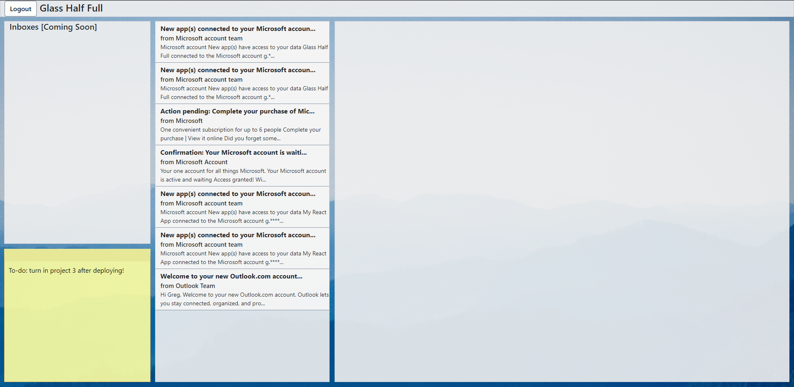

# Glass Half Full - Bringing you a better Outlook in life

## Screenshot

## Deployed at

https://glass-half-full.herokuapp.com/

## Description

This project, "Glass Half Full", was inspired by some of the issues my dad has had using Outlook as a mail service for his work. While it's nowhere near a "better Outlook" in its current state, I've begun laying the groundwork for what I hope can one day be a competent Outlook-based webapp for personal and business use. Currently, the app can authenticate Outlook users and receive recent emails from the Microsoft Graph API (which includes the Outlook API), view specific emails when selected, and save notes taken in the "sticky note" section of the page, useful for jotting down quick "to-do" lists during the work day or noting contact information quickly and conveniently for later. Note: The text typed in the sticky note is saved to a MySQL server on the backend and is UNENCRYPTED at the moment. While it's not directly associated with a user's name (just their Outlook ID, which is a random string of characters), it's not recommended that you type sensitive or private information (like passwords) into the sticky note for now. The app is also mobile responsive, though the sticky note is only available currently when viewing on larger screens. I'd like to continue developing this app over time, but for now there's not enough functionality to justify using it for any practical reason. This is more of an MVP and proof-of-concept than anything else.

This app was built in React and uses an Express server to handle routing queries. Messages and authentication are received through Microsoft's Graph API, and the sticky note sends and receives typed notes through a separate MySQL database using Sequelize.

## Use

In the top left corner of the page is a login button. When you click it, you can sign in using an existing Outlook account, and after providing permissions, you will be able to view recent messages from your inbox on the page. If you click the preview of a message, that message will be displayed fully on the right-hand side of the page. When using Glass Half Full on mobile, the elements resize and reposition for a better user experience. On larger screens, there's a "sticky note" in the bottom-left corner of the page that can be typed into to save short notes throughout the day. This sticky note is currently unavailable on smaller screens (like phones and other similarly-sized mobile devices), but the information is stored to a database and associated with your account ID, so it can be viewed and edited on any device you're signed in on.

## Contributors

Greg Sonnier | https://github.com/gsonnier333 | https://www.linkedin.com/in/greg-sonnier

## License

Copyright 2021 Greg Sonnier

Permission is hereby granted, free of charge, to any person obtaining a copy of this software and associated documentation files (the "Software"), to deal in the Software without restriction, including without limitation the rights to use, copy, modify, merge, publish, distribute, sublicense, and/or sell copies of the Software, and to permit persons to whom the Software is furnished to do so, subject to the following conditions:

The above copyright notice and this permission notice shall be included in all copies or substantial portions of the Software.

THE SOFTWARE IS PROVIDED "AS IS", WITHOUT WARRANTY OF ANY KIND, EXPRESS OR IMPLIED, INCLUDING BUT NOT LIMITED TO THE WARRANTIES OF MERCHANTABILITY, FITNESS FOR A PARTICULAR PURPOSE AND NONINFRINGEMENT. IN NO EVENT SHALL THE AUTHORS OR COPYRIGHT HOLDERS BE LIABLE FOR ANY CLAIM, DAMAGES OR OTHER LIABILITY, WHETHER IN AN ACTION OF CONTRACT, TORT OR OTHERWISE, ARISING FROM, OUT OF OR IN CONNECTION WITH THE SOFTWARE OR THE USE OR OTHER DEALINGS IN THE SOFTWARE.
